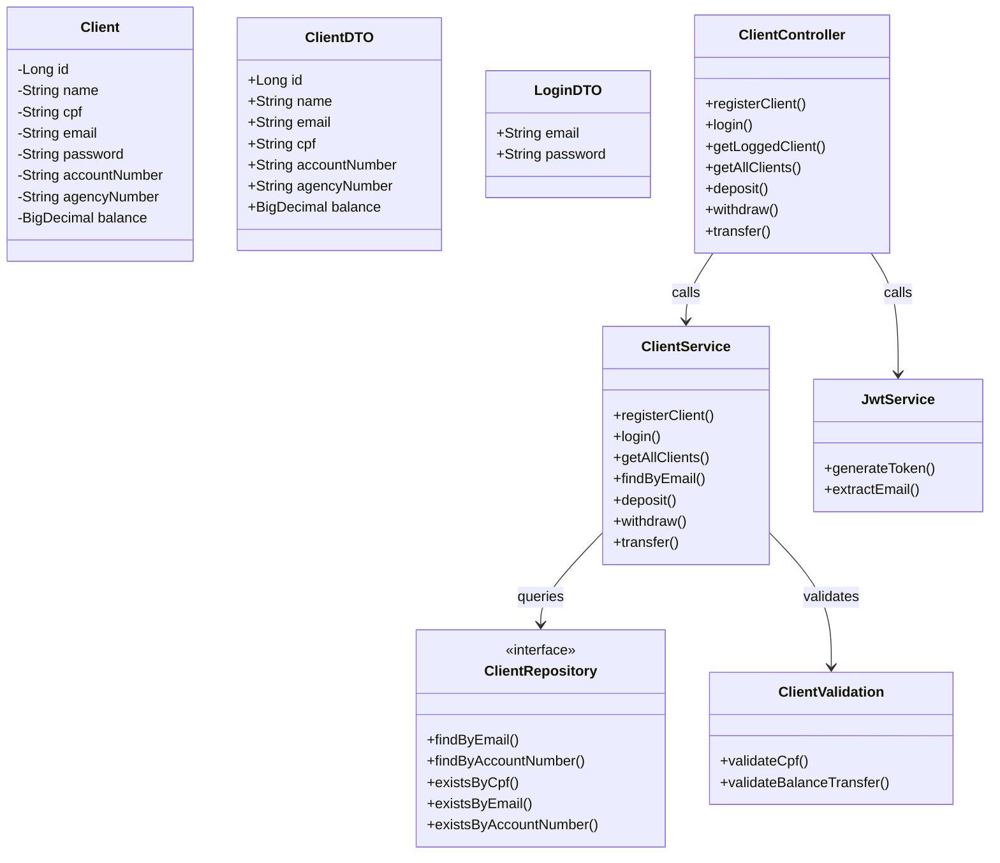

# 🏦 Banking API — Desafio Técnico Itaú

API REST para operações bancárias básicas desenvolvida com **Java 21**, **Spring Boot 3**, **Spring Security (JWT)** e **H2 Database**, seguindo os requisitos do desafio técnico do Itaú Unibanco.

---

## 📌 Sobre o Projeto

Este projeto implementa todas as funcionalidades solicitadas, além de diversos aprimoramentos que tornam a aplicação mais robusta, segura e próxima de um sistema real.

### Funcionalidades do desafio:
- ✔ Criação de contas  
- ✔ Consulta de saldo  
- ✔ Transferências  
- ✔ Armazenamento totalmente em memória  
- ✔ Documentação com Swagger  

#### Além do solicitado, o projeto também inclui:

- ✔ Depósitos  
- ✔ Saques  
- ✔ Tratamento global de exceções  
- ✔ Validações de CPF  
- ✔ Estrutura profissional em camadas  
- ✔ Testes unitários com Mockito
- ✔ Autenticação e autorização com Spring Security
- ✔ Geração de Tokens JWT
- ✔ Endpoints privados protegidos por Bearer Token

#### Funcionalidades além do backend:

- Frontend completo para consumir a API
- Desenvolvido para facilitar o uso e testar fluxos reais
- Inclui tela de login, cadastro, dashboard com acesso as operações bancárias

---

## 🌍 Por que as classes e métodos estão em inglês?

As classes, métodos e camadas do sistema estão nomeados em inglês por uma razão importante:

> **O inglês é o padrão universal na indústria de tecnologia.**  

Escolhi seguir esse padrão para manter o código mais profissional, alinhado a projetos reais e acessível para qualquer desenvolvedor. 

---


## 🛠 Tecnologias Utilizadas

- Java 21  
- Spring Boot 3  
- Spring Web  
- Spring Data JPA
- Spring Security + JWT
- Spring Validation  
- H2 Database  
- Lombok  
- SpringDoc OpenAPI (Swagger)  
- Maven  
- Mockito & JUnit 5
- Frontend próprio usando HTML, CSS e JavaScript

---

## 📦 Estrutura do Projeto
```
src/main/java/com/itau/desafiotecnico/larissa/banking/
├── config/
│ └── SwaggerConfig.java           # Configurações do Swagger
├── controller/
│ └── ClientController.java        # Endpoints REST
├── entity/
│ └── Client.java                  # Entidade da conta
├── exception/                     # Pasta responsável por armazenar as exceções do projeto e o tratamento global delas
│ ├── DuplicateClientException.java
│ ├── InvalidCpfException.java
│ ├── ClientNotFoundException.java
│ ├── GlobalExceptionHandler.java
│ ├── InvalidCpfException.java
│ ├── InvalidCredentialsException.java
├── repository/
│ └── ClientRepository.java        # Repositório JPA
├── security/
│ └── JwtFilter.java               # # Filtro JWT
│ ├── SecurityConfig.java          # Configurações do Spring Security
├── service/
│ └── ClientService.java           # Regras de negócio
│ ├── JwtService.java              # Geração/validação de tokens
├── validation/                     
│ └── ClientValidation.java        # Validações da entidade Client
└── BankingAppItauApplication.java # Classe principal
```
---
##  🧩  Diagrama UML

---

## 🎯 Endpoints da API

### Contas
| Método | Endpoint                  | Descrição |
|--------|---------------------------|-----------|
| POST   | `/clients/register`                | Criar nova conta |
| POST   | `/clients/login`                | Login do Cliente, retorna token JWT |
| GET    | `/clients/me`   | Obter dados do cliente logado |
| GET    | `/clients/{id}/balance`   | Consultar saldo |

### Operações Bancárias
| Método | Endpoint     | Descrição |
|--------|--------------|-----------|
| POST   | `/{accountNumber}/deposit`   | Realizar depósito |
| POST   | `/{accountNumber}/withdraw`  | Realizar saque |
| POST   | `/transfer`  | Transferência entre contas |

---

## 🚀 Como Executar

### Pré-requisitos
- Java 21  
- Maven 3.6+

### Passo a passo (Usando o Swagger)

**1️⃣ Clonar o repositório**
```bash
git clone https://github.com/lariiscriis/banking-app-itau
cd banking-app-itau
```

**2️⃣ Executar a aplicação**
```
mvn spring-boot:run
```
**3️⃣ Acesse o Swagger**
👉 ` http://localhost:8080/swagger-ui/index.html`

#### Faça cadastro
- Vá até o endpoint `/register`
- Clique em **Try it out**
- Envie:
```
  {
  "name": "Alice Santos",
  "cpf": "12345678909",
  "email": "alice@test.com",
  "password": "123456",
  "accountNumber": "00012345",
  "agencyNumber": "0001",
  "balance": 1000.00
  }
```
Ou 
```
{
  "name": "Bruno Oliveira",
  "cpf": "98765432100",
  "email": "bruno@test.com",
  "password": "123456",
  "accountNumber": "00054321",
  "agencyNumber": "0001",
  "balance": 500.00
}
```

> **⚠ Observação sobre CPF:**
Os cpf's fornecidos precisam ser válidos segundo o calculo de dígito verificador, os fornecidos acima são válidos para teste.
---

Após o cadastro:

#### Faça login:
- Vá até o endpoint `/login`
- Clique em **Try it out**
Envie:
```
{
  "email": "emailUsadoNoCadastro@gmail.com",
  "password": "123456"
}
```

➡ Você receberá um token como este:
```
eyJhbGciOiJIUzI1NiIsInR5...
```

**4️⃣ Usando o token no Swagger**

1 - No topo da página, clique em Authorize

2- No campo, cole o token obtido no `/login`:
```
Bearer eyJhbGciOiJIUzI1NiIsInR5...
```
3 - Clique em Authorize e depois Close

> Agora todos os endpoints protegidos funcionarão normalmente e você poderá testar todos.

### 💻Como executar pelo Frontend Integrado

Além da API, o projeto possui um frontend próprio que facilita o teste e demonstração do sistema.

O frontend inclui:
- Tela de login e Cadastro
- Dashboard com nome do cliente e saldo
- Botões para depósito, saque e transferência
- Logout funcional
- Armazenamento do token JWT no localStorage
- Consumo automático da API com Authorization Header

Como usar:
- Inicie o backend
- Abra o endereço `http://localhost:8080/index.html` no navegador
- Faça Cadastro e Login
- Use a interface visual para interagir com a API
 
---

### 📚 Conclusão

Este projeto cumpre todos os requisitos do desafio técnico e adiciona boas práticas importantes, apresentando uma API organizada, clara, documentada e funcional.
